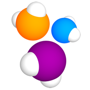
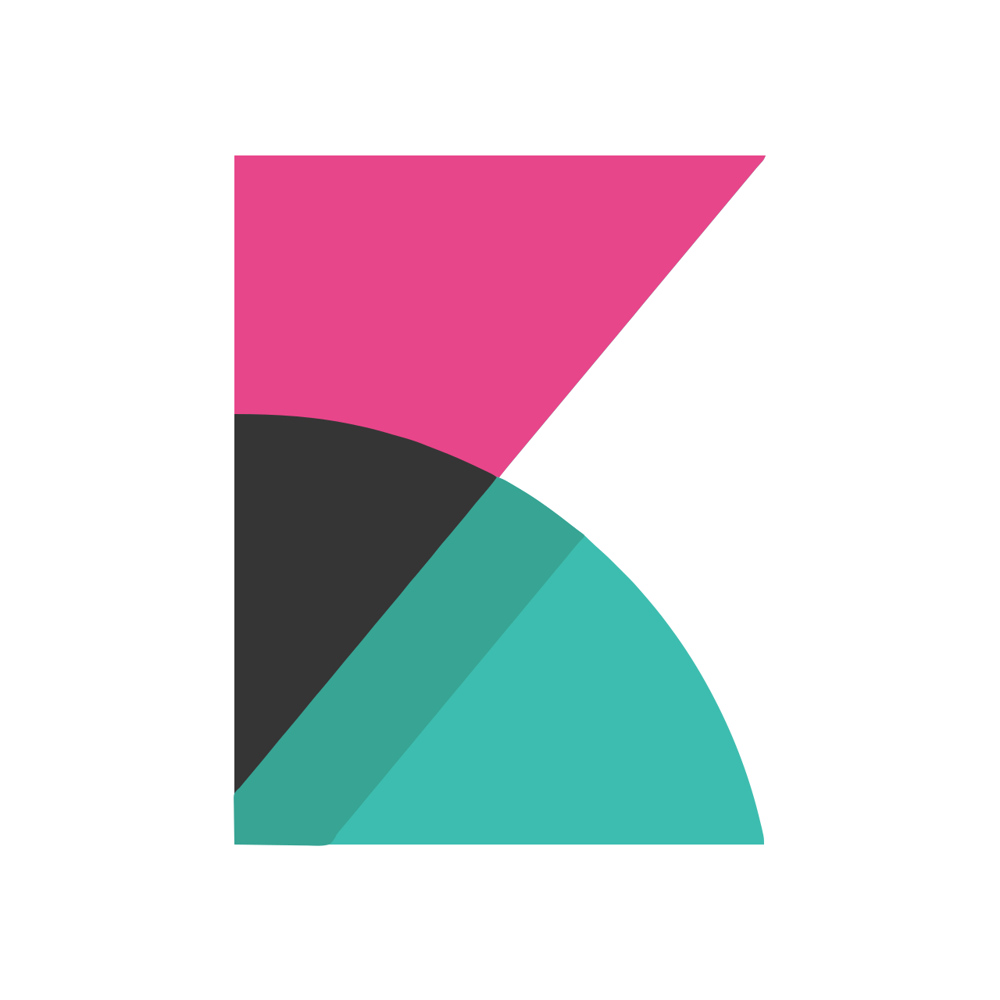
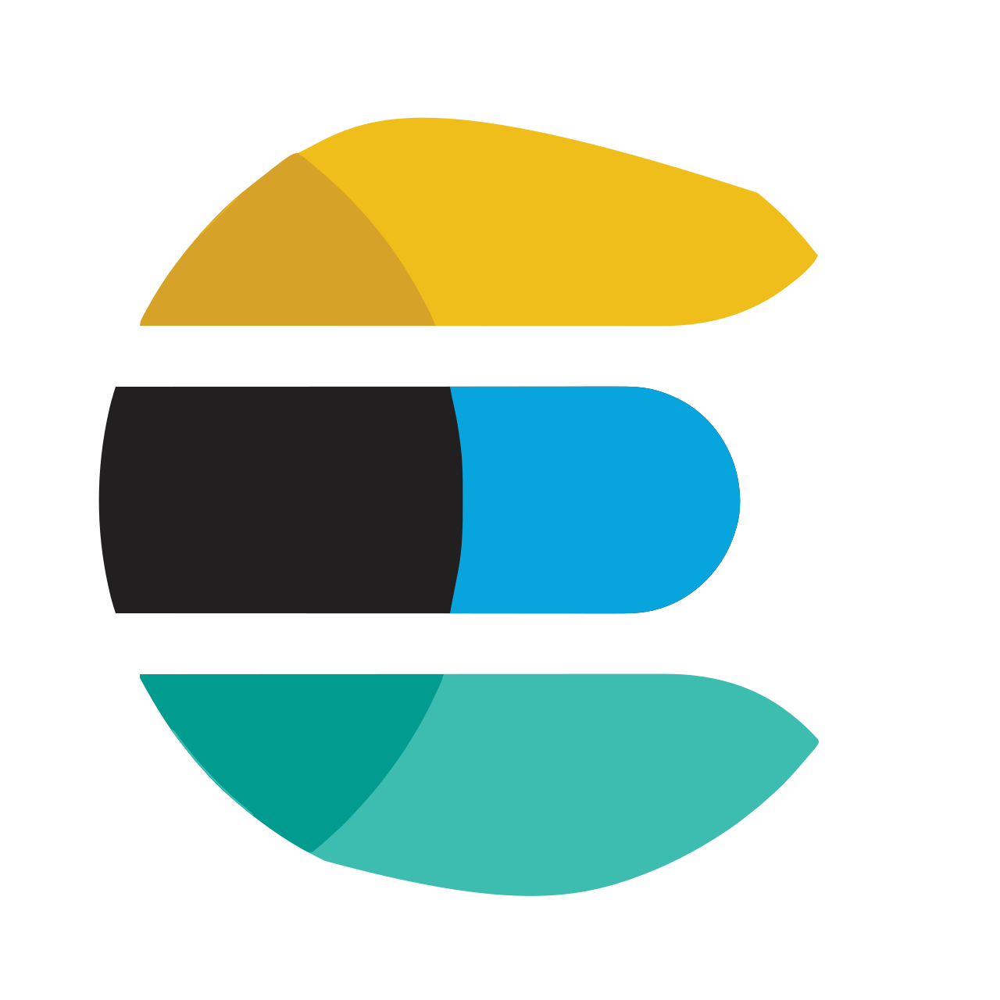
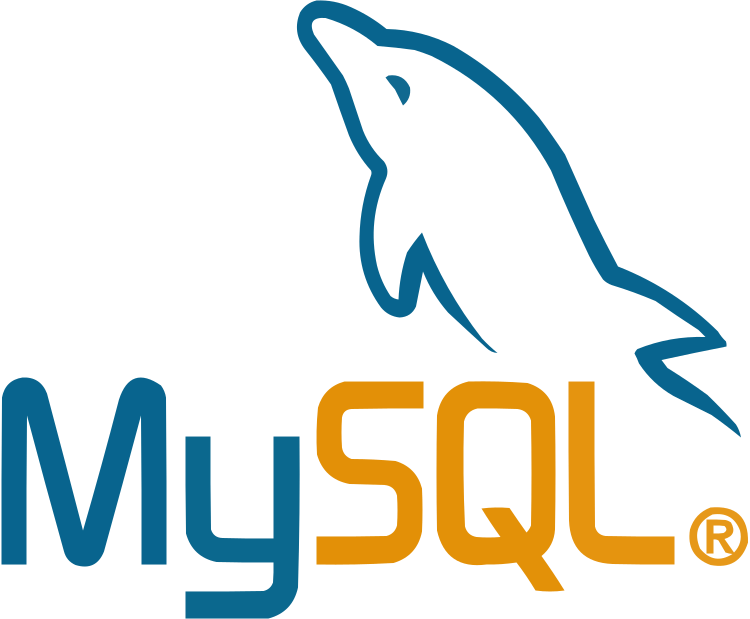
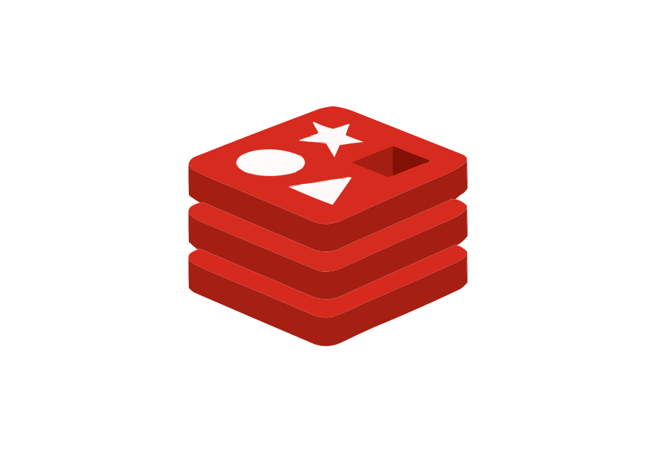

  

## About me
Меня зовут Сергей, и я - QA Engineer с 4+ летним опытом работы в сфере обеспечении качества сложных программных решений. Я готов предложить свои навыки и знания для успешной реализации ваших проектов. Мой опыт включает в себя полный цикл тестирования, от анализа требований до автоматизации и управления дефектами.

В течение последних 3+ лет я успешно работал над проектом “RightWay” (Решение для автоматизации, цифровизации бизнеса и управления лояльностью клиентов), где отвечал за организацию процесса тестирования, руководство командой и обеспечение высокого качества продукта.

Мои основные обязанности включали в себя:
- Управление командой тестирования: Организация и контроль работы команды тестирования, распределение задач, ревью задач на тестирование, а также наставничество коллег и проведение встреч 1-1.
- Планирование и оценка: Участие в планировании спринтов, оценка и постановка задач на тестирование, анализ требований и оценка поставленных задач.
- Разработка стратегии тестирования: Разработка тест-планов, тест-кейсов и чек-листов, учитывая особенности продукта и требования к качеству.
- Проведение различных видов тестирования: Опыт проведения функционального, системного, нагрузочного, регрессионного, интеграционного и юзабилити-тестирования.
- Автоматизация тестирования: Разработка и поддержка автоматизированных тестов (UI + API), что позволило повысить скорость и эффективность тестирования.
- Тестирование API: Опыт тестирования API с использованием Postman, JMeter и SoapUI.
- Работа с БД: PostgreSQL, Redis, MongoDB, ClickHouse, MySQL.
- Работа с дефектами: Выявление, локализация и регистрация дефектов, контроль процесса их исправления, используя инструменты, такие как Kibana, Elasticsearch, RabbitMQ, Devtools.
- Подготовка тестовых сред и данных: Подготовка и настройка тестовых сред, а также подготовка тестовых данных.
- Взаимодействие с командой: Эффективное взаимодействие с командами разработки, аналитики и клиентского сервиса, участие в проработке постановки задач.
- Работа с документацией / требованиями: Анализ требований. Работа с документацией по продукту (Confluence Wiki).

Ключевые достижения:
- Повышение эффективности тестирования и улучшение качества продукта: Внедрение автоматизированных тестов для смок и регрессионного тестирования с использованием стека (Java, Gradle, Selenide, RestAssured, AllureReport, Zephyr, Jenkins, Bitbucket, Selenoid) позволило сократить время ручного тестирования системы и перенаправить его на еще более глубокое исследование работы системы и дальнейшего улучшения ее качества.
- Оптимизация процессов тестирования: Внедрена новая методика анализа требований, что позволило сократить количество дефектов, выявленных на поздних этапах разработки и улучшения понимания продукта аналитиками.
- Эффективное управление командой: Обеспечено успешное выполнение всех поставленных задач командой тестирования, что привело к своевременному выпуску релизов и удовлетворению потребностей бизнеса. Переработка онбординга по команде тестирования позволила ускорить погружение новых сотрудников в проект.

## Technology Stack

  <code></code>
  <code></code>
  <code></code>
  <code></code>
  <code></code>
  <code></code>
  <code></code>
  <code></code>
  <code></code>
  <code></code>
  <code></code>
  <code></code>
  <code></code>
  <code></code>  
  <code></code>
  <code></code>
  <code></code>
  <code></code>
  <code></code>
  <code></code>
  <code></code>
  <code></code>
  <code></code>
  <code></code>
  <code></code>
  <code></code>

## My Projects

## Contacts

  <code></code>

